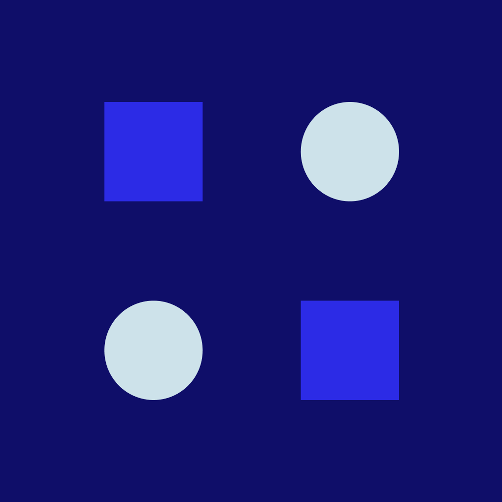

# GlassVC — React Native Virtual Card UI Demo

<p align="center">
  
</p>

<p align="center">
  <strong>A Virtual Credit Card dashboard and creation UI.</strong> Built with modern React Native, Expo SDK 54, and NativeWind v4, following top-tier design guidelines.
</p>

<p align="center">
  <a href="https://expo.dev"></a>
  <a href="https://reactnative.dev"></a>
  <a href="https://tailwindcss.com"></a>
  <a href="https://www.typescriptlang.org"></a>
</p>

---

## 📱 Visual Showcase & UI Gallery

Experience the premium aesthetics and glassmorphism UI of **GlassVC**. in the images used (not enough elements to create glassmorphism) look-and-feel 

### 🎥 Interaction Video Walkthrough

https://github.com/user-attachments/assets/3178692e-a153-4498-89d8-4a2365689555

## 🎨 Design Reference & Credits

This UI implementation is modeled after an amazing design from the Figma community.

- **Figma Design Link:** [Figma Design](https://www.figma.com/community/file/1207623139360246689/glassmorphism-in-mobile-app-design)
- **Original Creator Profile:** [Nidhyy](https://www.figma.com/@nidhyy)
- **Shoutout to the Creator:** Big shoutout to the original designer for crafting this beautiful, sleek, and modern mobile app visual theme!

---

## 🛠️ Tech Stack & Key Dependencies

*   **Framework:** [Expo SDK 54](https://expo.dev/) (React Native v0.81.5)
*   **Styling:** [NativeWind v4](https://www.nativewind.dev/) (Tailwind CSS engine)
*   **Vector Engine:** [React Native SVG](https://github.com/software-mansion/react-native-svg) + `react-native-svg-transformer` for direct import of custom vectors.
*   **Routing:** [Expo Router](https://docs.expo.dev/router/introduction/) (File-Based Navigation)
*   **Fonts:** K2D 

---

## 📂 Codebase Architecture

```yaml
GlassVC/
├── app/                        # Expo Router Navigation Stack & Pages
│   ├── (tabs)/                 # Main Navigation Tab Container
│   │   ├── _layout.tsx         # Custom TabBar layout with SVG mask & rotated FAB
│   │   ├── create-vc-redirect  # Redirect handler for the card creator page
│   │   ├── home.tsx            # Dashboard featuring balance, limit cards & transactions
│   │   ├── profile.tsx         # User settings placeholder
│   │   └── receipt.tsx         # Invoice records placeholder
│   ├── create-vc/
│   │   └── index.tsx           # Form with input text & custom weekly limit selector
│   ├── _layout.tsx             # Root stack navigator and font loader (K2D font bundle)
│   └── index.tsx               # Onboarding screen featuring premium card assets
├── assets/                     # Graphic resources and icons
│   ├── fonts/                  # Custom K2D font variants (.ttf)
│   ├── icons/                  # Custom SVGs exported as React components
│   └── images/                 # Custom high-quality static graphics (e.g. Card Mockups)
├── components/                 # Screen-specific visual layouts & cards
│   ├── ScreenHeader.tsx        # Common page header component
│   ├── TabBarMaskedBackground  # Custom SVG background drawing the cutout mask for the FAB
│   └── TransactionCard.tsx     # Card representing recent payments (Netflix, Disney+, etc.)
├── shared/                     # Reusable foundational design primitives
│   ├── AppBox/                 # Customizable layout container with custom shadow presets
│   ├── AppButton/              # Brand primary action buttons
│   ├── AppScreen/              # Wrapper with safe area insets and statusbar style
│   └── AppText/                # Custom typography supporting custom fonts and scale overrides
├── constants/                  # Configuration values (Font mappings, static keys)
├── utils/                      # Helper utilities (Currency formatters, mathematical formatters)
└── tailwind.config.js          # Tailwind theme configurations (Brand colors, typography config)
```

---

## 🚀 Running the Project Locally

### 1. Prerequisites
Make sure you have Node.js and the Expo CLI installed on your machine. You will also need the [Expo Go](https://expo.dev/go) application on your physical device or an emulator running.

### 2. Clone the Repository
```bash
git clone https://github.com/Odelola/glassvc_uidemo.git
cd glassvc_uidemo
```

### 3. Install Dependencies
```bash
npm install
```

### 4. Start the Development Server
```bash
npm expo start
```

*   Press **`a`** to open on an Android emulator/device.
*   Press **`i`** to open on an iOS simulator.
*   Scan the QR code in your terminal with the **Expo Go app** (Android) or **Camera app** (iOS) to test on a physical device.

---

## 📐 Implementation Highlights & Design Details

### The Custom Tab Bar Mask (`TabBarMaskedBackground.tsx`)
Rather than relying on basic overlays, we utilize a mathematically computed Bezier curve inside an SVG `<Path>`:
```tsx
<Path
  d="M352.878 20C353.212 23.1131 354.587 26.1337 356.997 28.4966L396.904 67.6187C402.426 73.0315 ... 56 20H352.878Z"
  fill="white"
  filter="url(#shadow)"
/>
```
This draws a custom indentation which seamlessly matches the floating action button.

### Smart Typography Accessibility (`AppText`)
To ensure that large system accessibility font settings do not break the UI, we intercept the font sizing using:
```typescript
const _getScaledFontSize = (size: number) => {
    return PixelRatio.getFontScale() * size;
}
```
This allows the text styles to respect user accessibility preferences while keeping layout boundaries integer-aligned and fully readable.

---

## 🔒 License & Copyright

All rights reserved. This codebase is proprietary and confidential. 

Unauthorized copying, modification, distribution, or publication of this source code, via any medium, is strictly prohibited. It is shared publicly on GitHub solely as a visual portfolio showcase for code review and evaluation.

## Authors:

- [github@Odelola](https://github.com/odelola)
